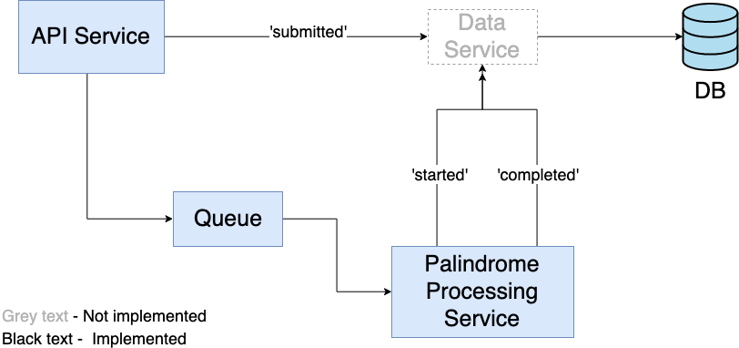

# Winnow Palindrome Problem 

## Solution overview
Microservices 



Consists of:
- __API Service__ (NodeJS + Express) - Entry point for the application. Exposes endpoints to end user
    - `POST /palindrome` Puts a palindrome problem on the queue
    - `GET /palindrome/{taskId}` Get a palindrome problem by taskId 
- __Queue__ (Redis) - Holds palindrome problems 
- __Palindrome Processing Service__ (NodeJS) - Picks palindrome problems off the queue, processes them to find a solution, saves the solution to the database.
- __DB__ (MongoDB) - persistence layer 

## Getting Started

These instructions will get you a copy of the project up and running on your local machine for development and testing purposes.

### Prerequisites

Docker and `docker-compose`

### Installing

Pull this repository onto your local and 

```
docker-compose up
```

The API will be exposed on Port 3000.

```
$curl -X POST \
  http://localhost:3000/palindrome \
  -H 'Content-Type: application/json' \
  -d '{
    "text": "I am anna"
}'
```
should return something like
```json
{
    "timestamps": {
        "submitted": 1568564742614,
        "started": 1568564742629,
        "completed": 1568564742649
    },
    "problem": {
        "text": "I am anna"
    },
    "solution": {
        "largestPalindrome": "anna",
        "largestPalindromeLength": 4
    },
    "_id": "5d7e6606c9697636601efbcb",
    "status": "completed",
    "__v": 0
}
```

## Running the tests

Each project has its own unit tests:
- `./api`  
- `./palindrome-service`

`cd` into the project and run `npm run test`. Prerequisite: Node and NPM installed on local machine.

## Built With

* [Node + NPM](https://nodejs.org/en/) - Server Side Framework
* [ExpressJS](https://expressjs.com/) - API Web Framework
* [MongoDB](https://www.mongodb.com/) - Database
* [Redis](https://redis.io/) - Queue with Pub/Sub
